# 🚀 AI Content Manager

**The Ultimate Single-File AI-Powered Content Management Platform**

*Transform the way you organize, analyze, and discover your digital content with the power of artificial intelligence - all running locally in your browser with complete privacy.*

## 📋 **Table of Contents**

- [🚀 Quick Start (30 seconds)](#-quick-start-30-seconds)
- [🎬 Demo Video](#-demo-video)  
- [📸 Screenshots](#-screenshots)
- [🌟 Revolutionary Features](#-revolutionary-features)
- [🚀 Getting Started](#-getting-started)
- [🏗️ Technical Architecture](#️-technical-architecture)
- [🌟 Unique Value Propositions](#-unique-value-propositions)
- [📊 Competitive Advantage Matrix](#-competitive-advantage-matrix)
- [🔮 Future Vision](#-future-vision)
- [🛠️ Development Roadmap](#️-development-roadmap)
- [⚠️ Known Limitations](#️-known-limitations)
- [🤝 Contributing & Community](#-contributing--community)
- [🙏 Acknowledgments](#-acknowledgments)

---

## 🚀 **Quick Start (30 seconds)**

**Want to try AI Content Manager right now?** Here's the fastest way:

```bash
# Method 1: Direct File Access (Simplest)
1. Download: ai_content_manager.html
2. Open in any modern browser
3. Drag & drop your content files
4. Click "AI Analyze" - Done! 🎉

# Method 2: Local Server (Recommended)  
python -m http.server 8000
# Open: http://localhost:8000/ai_content_manager.html
```

**⚡ That's it!** No installation, no signup, no data upload required. Your content stays 100% private on your device.

---

## 🎬 **Demo Video**

> 🎥 **Coming Soon**: Watch AI Content Manager in action!
> 
> See how easy it is to:
> - Load mixed content (images, documents, audios, videos)
> - Analyze with AI in one click  
> - Search across all content types
> - Export results for sharing
> 
> *Video demo will showcase the complete workflow from file loading to AI analysis and smart search across all four content types.*

---

## 📸 **Screenshots**

### 🖼️ **Unified Interface**
> 📷 **Coming Soon**: Tab-based interface showing all four content types
> 
> *Screenshot will display the clean, modern interface with Images, Documents, Audios, and Videos tabs, plus the universal search and AI model selection.*

### 🧠 **AI Analysis Results**
> 📷 **Coming Soon**: AI-powered content analysis in action
> 
> *Screenshots will show AI tags, classifications, and metadata automatically generated for different content types.*

### 🔍 **Universal Search**
> 📷 **Coming Soon**: Cross-content intelligent search
> 
> *Visual demonstration of searching across all content types simultaneously with smart scoring and clickable results.*

### 📱 **Mobile-Responsive Design**  
> 📷 **Coming Soon**: Perfect mobile experience
> 
> *Screenshots showing how the interface adapts beautifully to tablets and mobile devices.*

---

## 🌟 **Unique Features**

### 🧠 **Unified AI-Powered Analysis**
- **🖼️ Image Intelligence** - Object detection, scene analysis, face recognition with 3 specialized models
- **📄 Document Processing** - Keyword extraction, summarization, category classification
- **🎵 Audios Analysis** - Genre detection, mood analysis, instrument identification
- **🎬 Video Understanding** - Scene detection, object tracking, activity recognition

### 🎯 **One Platform, Four Content Types**
| Content Type | AI Models | Unique Features | File Formats |
|--------------|-----------|----------------|--------------|
| **Images** | MobileNet v2, EfficientNet, MediaPipe | Slideshow, Visual Search, Batch Analysis | JPG, PNG, GIF, WEBP, BMP |
| **Documents** | BERT, GPT-based NLP, Custom Extractors | Smart Summarization, Keyword Clouds | PDF, DOC, DOCX, TXT, MD |
| **Audio** | Audio-BERT, MusicCNN, Universal Audio | Genre Classification, Mood Detection | MP3, WAV, FLAC, AAC, OGG |
| **Videos** | VideoNet, Action Recognition, Scene Analysis | Activity Detection, Timeline Analysis | MP4, AVI, MOV, WMV, WEBM |

### 💡 **Game-Changing Architecture**

#### ⚡ **Zero-Infrastructure Deployment**
```bash
# Deploy to millions instantly - no servers needed
git push origin main          # Auto-deploy via GitHub Pages
cp ai_content_manager.html /var/www/  # Any web server
zip -r suite.zip ai_content_manager.html  # Offline distribution
```

#### 🌍 **Infinite Scalability at Zero Cost**
- **1 user**: $0/month
- **1,000 users**: $0/month  
- **1,000,000 users**: $0/month
- **Enterprise deployment**: $0/month

#### 🔒 **Privacy-First by Design**
- **100% Local Processing** - No data ever leaves your device
- **Offline Capable** - Works completely without internet
- **GDPR/HIPAA Ready** - Enterprise compliance built-in
- **Air-Gap Compatible** - Perfect for sensitive environments

---

## 🎨 **Unified User Experience**

### 📱 **Responsive Tab-Based Interface**
```
┌─────────────────────────────────────────────────────────────┐
│ 🚀 AI Content Manager                    [Settings] [Help] │
├─────────────────────────────────────────────────────────────┤
│ 🖼️ Images │ 📄 Documents │ 🎵 Audios │ 🎬 Videos │ 📊 Dashboard │
├─────────────────────────────────────────────────────────────┤
│  🧠 AI Model: [MobileNet v2 ▼]  📁 Load  🔍 Search  💾 Export │
│  6 items loaded • 4 analyzed • Grid: ●●●○○○ • Show details ☑  │
├─────────────────────────────────────────────────────────────┤
│                                                             │
│  [Content Grid - Adaptive Layout Based on Content Type]    │
│                                                             │
└─────────────────────────────────────────────────────────────┘
```

### 🎛️ **Smart Context-Aware Controls**
- **Shared Controls**: AI Model Selection, Load Files, Search, Export/Import
- **Content-Specific**: 
  - 🖼️ Images: Slideshow, Visual Similarity
  - 📄 Documents: Text Analysis, Summary Generation  
  - 🎵 Audios: Playlist Creator, Genre Filters
  - 🎬 Videos: Timeline Scrubbing, Scene Navigation

---

## 🚀 **Getting Started**

### **Instant Setup (< 30 seconds)**
```bash
# Option 1: Direct use
open ai_content_manager.html

# Option 2: Local server
python -m http.server 8000
open http://localhost:8000/ai_content_manager.html

# Option 3: Deploy anywhere
scp ai_content_manager.html user@server:/var/www/html/
```

### **Basic Workflow**
1. **Choose Content Type** - Click Images/Documents/Audio/Videos tab
2. **Load Your Content** - Drag & drop or select files/folders
3. **Select AI Model** - Choose the best model for your needs
4. **Analyze with AI** - One-click intelligent processing
5. **Search & Discover** - Find content by filename, AI tags, or content
6. **Export Results** - Save analysis for sharing or backup

---

## 🏗️ **Technical Architecture**

### 📋 **System Overview**

```mermaid
graph TB
    subgraph "🚀 AI Content Manager - Unified Architecture"
        subgraph "🎨 Frontend Layer"
            UI[Tab-Based Interface]
            TAB1[🖼️ Images Tab]
            TAB2[📄 Documents Tab] 
            TAB3[🎵 Audios Tab]
            TAB4[🎬 Videos Tab]
            TAB5[📊 Dashboard Tab]
        end
        
        subgraph "🧠 Core Engine"
            CORE[Core Engine]
            SEARCH[Universal Search]
            AI_MGR[AI Model Manager]
            STORAGE[Storage Engine]
        end
        
        subgraph "📱 Content Processors"
            IMG_PROC[Image Processor]
            DOC_PROC[Document Analyzer]
            AUD_PROC[Audio Processor]
            VID_PROC[Video Analyzer]
        end
        
        subgraph "💾 Storage Layer"
            LOCAL[Local Storage<br/>IndexedDB]
            CLOUD[Cloud Storage<br/>Optional]
        end
    end
    
    UI --> TAB1
    UI --> TAB2
    UI --> TAB3
    UI --> TAB4
    UI --> TAB5
    
    TAB1 --> IMG_PROC
    TAB2 --> DOC_PROC
    TAB3 --> AUD_PROC
    TAB4 --> VID_PROC
    
    CORE --> SEARCH
    CORE --> AI_MGR
    CORE --> STORAGE
    
    STORAGE --> LOCAL
    STORAGE --> CLOUD
```



### 🔄 **Data Flow Architecture**

```mermaid
graph LR
    subgraph "📁 Input Methods"
        FILES[User Content]
        DRAG[Drag & Drop]
        SELECT[Select Files]
        FOLDER[Select Folder<br/>⚠️ Ubuntu Issue]
    end
    
    subgraph "🧠 AI Processing"
        LOAD[Load & Validate]
        AI_PROC[AI Analysis]
        META[Generate Metadata]
    end
    
    subgraph "🔍 Search & Discovery"
        SEARCH[Universal Search]
        FILENAME[Filename Search]
        AI_TAGS[AI Tags Search]
        CONTENT[Content Search]
    end
    
    subgraph "📤 Output"
        DISPLAY[Grid Display]
        EXPORT[Export JSON]
        ACTIONS[Content Actions]
    end
    
    FILES --> DRAG
    FILES --> SELECT  
    FILES --> FOLDER
    
    DRAG --> LOAD
    SELECT --> LOAD
    FOLDER --> LOAD
    
    LOAD --> AI_PROC
    AI_PROC --> META
    
    META --> SEARCH
    SEARCH --> FILENAME
    SEARCH --> AI_TAGS
    SEARCH --> CONTENT
    
    SEARCH --> DISPLAY
    DISPLAY --> EXPORT
    DISPLAY --> ACTIONS
```



**Detailed Diagrams**: See individual files in [docs/](docs/) directory:
- [architecture-overview.mmd](docs/architecture-overview.mmd) 
- [data-flow.mmd](docs/data-flow.mmd)
- [cloud-hybrid-architecture.mmd](docs/cloud-hybrid-architecture.mmd)
- [deployment-modes.mmd](docs/deployment-modes.mmd)

---

### 🧱 **Modular Design**
```javascript
// Unified Core with Specialized Modules
AI_Content_Manager = {
  core: {
    ui: "Unified tab-based interface",
    search: "Cross-content intelligent search", 
    storage: "Local persistence & export/import",
    ai_engine: "TensorFlow.js model management"
  },
  modules: {
    image_processor: "Visual analysis & slideshow",
    document_analyzer: "Text extraction & NLP",
    audio_processor: "Music analysis & classification", 
    video_analyzer: "Scene detection & activity recognition"
  }
}
```

### 🤖 **AI Model Strategy**
```javascript
const AI_MODELS = {
  images: {
    mobilenet: "Fast general classification",
    efficientnet: "Balanced accuracy/speed",
    mediapipe: "Advanced computer vision"
  },
  documents: {
    bert_base: "Keyword extraction",
    gpt_summarizer: "Text summarization", 
    custom_nlp: "Domain-specific analysis"
  },
  audio: {
    audio_bert: "Fast similarity search",
    music_cnn: "Genre & mood detection",
    universal_audio: "Comprehensive analysis"
  },
  videos: {
    video_net: "Scene classification",
    action_recognition: "Activity detection",
    object_tracker: "Multi-object tracking"
  }
};
```

### 📊 **Shared Data Schema**
```javascript
const UNIFIED_CONTENT_SCHEMA = {
  id: "unique_identifier",
  type: "image|document|audio|video",
  filename: "original_filename.ext",
  metadata: {
    size: "file_size_bytes",
    created: "timestamp",
    modified: "timestamp"
  },
  ai_analysis: {
    model_used: "model_identifier",
    confidence: 0.95,
    tags: ["tag1", "tag2"],
    categories: ["category1"],
    custom_fields: {} // Type-specific data
  },
  user_data: {
    caption: "user_caption",
    rating: 5,
    custom_tags: ["user_tag1"]
  }
};
```

---

## 🌟 **Value Propositions**

### 🏢 **For Enterprises**
- **Zero Infrastructure Costs** - No servers, databases, or cloud bills
- **Instant Global Deployment** - One file deploys worldwide
- **Complete Data Privacy** - All processing happens locally
- **Regulatory Compliance** - GDPR, HIPAA, SOX ready out-of-the-box
- **Custom Branding** - Easy white-labeling for organizations

### 👨‍👩‍👧‍👦 **For Families**
- **Memory Preservation** - AI-powered family photo/video organization
- **Easy Sharing** - Zip and share entire libraries with metadata
- **Kid-Friendly** - Intuitive interface loved by children
- **Privacy Protected** - Family memories stay on your devices

### 🎓 **For Students & Researchers**
- **Research Organization** - AI-powered paper and document management
- **Media Analysis** - Advanced audio/video content analysis
- **Collaboration Ready** - Share analysis results across teams
- **Academic Integrity** - All processing transparent and auditable

### 🎨 **For Content Creators**
- **Asset Management** - Intelligent organization of creative assets
- **Inspiration Discovery** - Find similar content for creative projects
- **Batch Processing** - Analyze thousands of files efficiently
- **Portfolio Organization** - Smart categorization and tagging

### 🌍 **Global Impact Potential**
- **Students** organizing research materials efficiently
- **Families** preserving and discovering memories
- **Professionals** managing content libraries intelligently  
- **Enterprises** deploying AI content management at scale
- **Anyone** wanting powerful, private, local AI tools


### 📊 **Competitive Advantage Matrix**

| Feature | Traditional SaaS | Desktop Apps | AI Content Manager |
|---------|-----------------|--------------|-------------------|
| **Privacy** | ❌ Cloud-dependent | ✅ Local | ✅ 100% Local |
| **Cost** | 💰 Monthly fees | 💰 License fees | ✅ $0 Forever |
| **Deployment** | 🔧 Complex setup | 📦 Installation | ✅ Single file |
| **Scalability** | 📈 Expensive scaling | ❌ Per-machine | ✅ Infinite @ $0 |
| **AI Power** | ✅ Cloud AI | ❌ Limited | ✅ Advanced local AI |
| **Offline Use** | ❌ Internet required | ✅ Works offline | ✅ 100% Offline |
| **Updates** | 🔄 Auto-updates | 📦 Manual updates | ✅ Git-based updates |

---


## 🔮 **Future Vision**

### 🧠 **Advanced AI Integration**
```javascript
// Expanding AI Capabilities
const FUTURE_AI_FEATURES = {
  "Smart Recommendations": "Find related content across all types",
  "Duplicate Detection": "Identify similar content intelligently", 
  "Auto-Organization": "AI-powered folder structure suggestions",
  "Voice Commands": "Natural language content queries",
  "Real-time Translation": "Multi-language document support",
  "Custom Model Training": "Train AI on your specific content"
};
```

### 🌐 **Platform Ecosystem**
- **Plugin Architecture** - Community-contributed AI models
- **API Framework** - Integration with other tools
- **Template Gallery** - Pre-configured setups for different use cases
- **Model Marketplace** - Specialized AI models for niche domains

---

## 🛠️ **Development Roadmap**

### 🎯 **Phase 1: Foundation (Current)**
- ✅ Four individual specialized apps created
- ✅ Enhanced search functionality across all apps
- ✅ Consistent UI/UX patterns established
- ✅ Privacy-first local processing proven

### 🚀 **Phase 2: Unification (In Progress)**
- 🔄 Tab-based unified interface design
- 🔄 Shared component architecture
- 🔄 Cross-content type search
- 🔄 Unified data management

### 🌟 **Phase 3: Enhanced AI & Backend Integration**
- 🚨 **Critical: Replace Mock AI Models with Real TensorFlow.js Implementations**
  - Implement actual MobileNet v2 image classification
  - Add real EfficientNet with proper preprocessing  
  - Integrate MediaPipe for advanced computer vision
  - Fix image preprocessing (resize, normalize pixel values)
  - Map prediction indices to actual ImageNet class labels
- 💾 **Two-Tier Architecture Strategy**
  
  **📱 Tier 1: Client-Only Mode (Current)**
  - Single HTML file with temporary AI analysis
  - Perfect for quick content review and testing
  - No persistence, no backend required
  
  **🚀 Tier 2: Full Content Library Mode**
  - **Import Workflow**: Bulk import from standard OS folders:
    - `~/Pictures` → Image content library
    - `~/Documents` → Document content library  
    - `~/Music` → Audio content library
    - `~/Videos` → Video content library
  - **DuckDB Backend**: Single portable `.duckdb` file contains entire digital library
  - **FastAPI Integration**: Frontend ↔ Backend communication for persistence
  - **Semantic Search**: Vector embeddings + HNSW indexing for intelligent content discovery
  
  **🎯 Core Value Proposition:**
  - **No Backend = No Semantic Search** (clear upgrade incentive)
  - **With Backend = Unified Digital Content Library** across all media types
  - **One File = Everything** (entire library in portable `.duckdb` file)
  
  **🔧 Technical Architecture:**
  - **Database**: DuckDB with VSS extension for vector embeddings
  - **Vector Search**: `array_cosine_similarity()` for semantic content search  
  - **File Storage**: Original files stay in place, metadata + thumbnails in DuckDB
  - **API Layer**: FastAPI backend with WebSocket support for real-time analysis
  - **Portability**: Single `.duckdb` file = backup/share entire library
  
  **📦 Deployment Benefits:**
  - **Easy Backup**: Copy one `.duckdb` file
  - **Easy Sharing**: Send `.duckdb` file to friends/colleagues
  - **Easy Migration**: Move library between computers effortlessly
  - **Privacy First**: Everything stays local, no cloud dependency

### 🔧 **DuckDB Backend Implementation Plan**
```sql
-- Core schema design
CREATE TABLE content_library (
    id UUID PRIMARY KEY,
    filename VARCHAR NOT NULL,
    content_type VARCHAR CHECK (content_type IN ('image', 'document', 'audio', 'video')),
    file_path VARCHAR,        -- Cloud storage path or local path
    file_size BIGINT,
    mime_type VARCHAR,
    thumbnail BLOB,           -- Small preview thumbnails
    embedding FLOAT[1536],    -- AI-generated embeddings for semantic search
    ai_tags VARCHAR[],        -- Array of AI-generated tags
    ai_model_used VARCHAR,    -- Which AI model generated the analysis
    confidence_score FLOAT,   -- AI analysis confidence
    user_caption TEXT,        -- User-added captions/notes
    metadata JSON,            -- Flexible metadata (EXIF, duration, etc.)
    created_at TIMESTAMP DEFAULT NOW(),
    analyzed_at TIMESTAMP
);

-- Create HNSW index for fast vector similarity search
CREATE INDEX embedding_hnsw_idx ON content_library 
USING HNSW (embedding) WITH (metric = 'cosine');

-- Semantic search query examples
-- Find similar content across all types
SELECT filename, content_type, 
       array_cosine_similarity(embedding, ?) AS similarity
FROM content_library 
WHERE embedding IS NOT NULL
ORDER BY similarity DESC 
LIMIT 20;

-- Find similar images only
SELECT filename, ai_tags,
       array_cosine_similarity(embedding, ?) AS similarity  
FROM content_library 
WHERE content_type = 'image' AND embedding IS NOT NULL
ORDER BY similarity DESC 
LIMIT 10;
```

**🚀 API Architecture:**
- **FastAPI/Express** backend with DuckDB connection
- **TensorFlow.js integration** for generating embeddings server-side
- **Multipart upload** for large files to blob storage
- **Real-time WebSocket** updates for analysis progress
- **RESTful endpoints** for CRUD operations + semantic search

### 🎯 **Phase 4: Advanced Features**
- 📋 Smart content recommendations across all media types
- 📋 Duplicate detection using AI similarity matching
- 📋 Advanced batch operations and bulk processing
- 📋 Custom AI model training interface for specialized domains
- 📋 Real-time collaborative content management

### 🎨 **Phase 5: Polish & Scale**
- 📋 Professional UI/UX refinements and animations
- 📋 Performance optimizations for large datasets
- 📋 Advanced accessibility features (WCAG compliance)
- 📋 Multi-language support and internationalization
- 📋 Mobile app versions (React Native/Flutter)
- 📋 Enterprise features and white-labeling options

---

## ⚠️ **Known Limitations**

### 🐧 **Ubuntu Folder Selection Issue**
**Problem**: On Ubuntu Linux, the "Select Folder" button may not work due to browser security restrictions and file system API limitations.

**Impact**: Users cannot bulk-load entire directories of content files at once.

**Workarounds**:
1. **Individual File Selection** (Recommended)
   ```bash
   # Use "Select Files" instead and multi-select files
   Ctrl+Click or Shift+Click to select multiple files
   ```

2. **Drag & Drop Method** (Best Experience)
   ```bash
   # Open file manager, select all files, then drag to browser
   nautilus /path/to/your/content/
   # Select files with Ctrl+A, then drag to AI Content Manager
   ```

3. **Command Line Symlink Workaround**
   ```bash
   # Create symlinks in a web-accessible directory
   mkdir ~/content-links
   ln -s /path/to/your/photos/* ~/content-links/
   # Then serve via local web server
   cd ~/content-links && python -m http.server 8000
   ```

4. **Browser-Specific Solutions**
   ```bash
   # Chrome with folder access (requires local server)
   google-chrome --allow-file-access-from-files ai_content_manager.html
   
   # Firefox usually works better for local file access
   firefox ai_content_manager.html
   ```

### 🌐 **General Browser Limitations**
- **Large File Processing**: Very large files (>100MB) may cause memory issues
- **Concurrent Processing**: Processing many files simultaneously may slow performance  
- **Mobile Browsers**: Some AI models may not load on older mobile browsers
- **Safari Restrictions**: iOS Safari has stricter file access limitations

### 🔧 **Planned Solutions**
- **Folder Upload Enhancement**: Working on progressive folder loading
- **Performance Optimization**: Implementing lazy loading and chunked processing
- **Mobile Support**: Optimizing AI models for mobile devices
- **Cross-Platform Testing**: Comprehensive testing across all major platforms

### 🚨 **Critical Issues**
- **AI Model Implementation**: Replace mock/fake AI models with actual TensorFlow.js implementations
  - Current models (MobileNet, EfficientNet, MediaPipe) are generating random tags instead of real AI analysis
  - Need to implement proper image preprocessing (resize, normalize pixel values)
  - Implement real `model.predict()` calls with preprocessed images
  - Map prediction indices to actual ImageNet class labels
  - This is causing completely incorrect image classifications (e.g., person → automobile, car → architecture)

### 💡 **Community Solutions Welcome**
Know a better workaround for Ubuntu folder selection? Please contribute via GitHub Issues!

---


## 🤝 **Contributing & Community**

### 🌟 **Join the Team**
We're building the future of content management - where powerful AI meets complete privacy and zero infrastructure costs. Here's how you can contribute:

- **🔬 Test & Feedback** - Help us polish the user experience
- **🧠 AI Models** - Contribute specialized TensorFlow.js models  
- **🎨 UI/UX** - Improve design and accessibility
- **📚 Documentation** - Help others discover and use the platform
- **🌍 Translation** - Make it accessible globally

### 📞 **Get Involved**
- **Issues & Ideas**: Use GitHub Issues for feedback
- **Development**: Fork, enhance, and submit pull requests
- **Community**: Join our discussions and share use cases

---

## 📜 **License**

**MIT License** - Free for personal, academic, and commercial use.

Feel free to use, modify, distribute, and build upon this platform. We believe powerful AI content management should be accessible to everyone, everywhere, at zero cost.

---

## 🙏 **Acknowledgments**

Built with ❤️ using:
- **TensorFlow.js** - Bringing AI to the browser
- **Modern Web APIs** - File handling, drag & drop, local storage
- **Human-AI Collaboration** - Where human creativity meets artificial intelligence via Claude Code

---

*"Transforming content management from expensive, privacy-invasive cloud services to powerful, private, zero-cost local AI platforms - one file at a time."*

**🚀 AI Content Manager - The Future of Content Management is Here.**