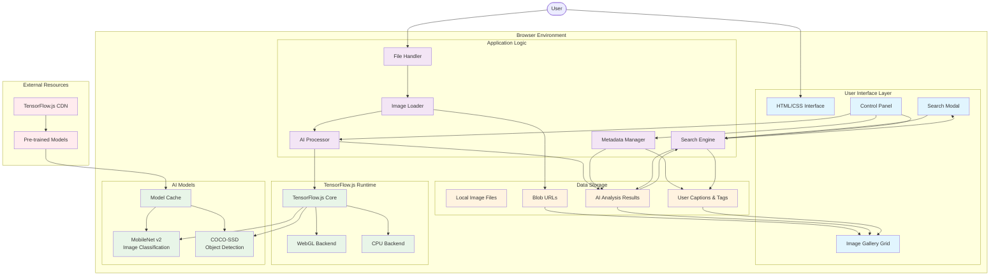
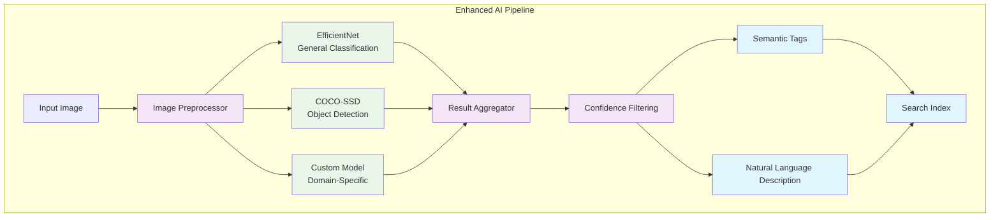

# AI Image Viewer - Architecture & Design

## 🏗️ Architecture Overview

Here's the complete system architecture of your AI Image Viewer:



## 🔍 Current MobileNet Implementation Analysis

Your app currently uses **MobileNet v2** at line 516:

```javascript
// Current implementation
mobilenetModel = await mobilenet.load(); // Loads MobileNet v2 by default
const classifications = await mobilenetModel.classify(img); // Returns top 3-5 predictions
```

### MobileNet v2 Limitations:
- **ImageNet-trained** - Focused on 1000 general object classes
- **Limited context** - Struggles with complex scenes, activities, emotions
- **Generic classifications** - Often returns technical terms like "sports car" instead of "red car"
- **No fine-grained details** - Can't distinguish specific breeds, models, or variations

## 🚀 Better TensorFlow.js Model Alternatives

### 1. **EfficientNet** (Recommended Upgrade)
```javascript
// Better accuracy than MobileNet
<script src="https://cdn.jsdelivr.net/npm/@tensorflow-models/efficientnet@1.0.0/dist/efficientnet.min.js"></script>

// Usage
const efficientnetModel = await efficientnet.load();
const predictions = await efficientnetModel.classify(imageElement);
```
**Benefits**: Higher accuracy, better scene understanding, similar performance to MobileNet

### 2. **MediaPipe Image Classifier** (Google's Latest)
```javascript
// State-of-the-art vision model
<script src="https://cdn.jsdelivr.net/npm/@mediapipe/tasks-vision@latest"></script>

// Usage - More modern API
const classifier = await ImageClassifier.createFromOptions(wasmFileset, {
  baseOptions: {
    modelAssetPath: 'https://storage.googleapis.com/mediapipe-models/image_classifier/efficientnet_lite0/float32/1/efficientnet_lite0.tflite'
  }
});
```
**Benefits**: Latest Google research, better real-world performance, more diverse training data

### 3. **Custom Vision Models** (Best for Specific Domains)
```javascript
// Load your own trained model
const customModel = await tf.loadLayersModel('path/to/your/model.json');

// For specific domains like:
// - Food classification
// - Plant/flower identification  
// - Fashion/clothing recognition
// - Medical imagery
```

### 4. **Multi-Model Ensemble** (Highest Accuracy)
```javascript
// Combine multiple models for better results
const models = {
  general: await mobilenet.load(),
  efficient: await efficientnet.load(),
  objects: await cocoSsd.load()
};

// Aggregate results with confidence weighting
```

## 🔧 Implementation Recommendations

### **Quick Win: Replace MobileNet with EfficientNet**

Here's the minimal change to upgrade your model:

```javascript
// Replace line 516 in your HTML:
// OLD:
<script src="https://cdn.jsdelivr.net/npm/@tensorflow-models/mobilenet@2.1.0/dist/mobilenet.min.js"></script>

// NEW:
<script src="https://cdn.jsdelivr.net/npm/@tensorflow-models/efficientnet@1.0.0/dist/efficientnet.min.js"></script>
```

```javascript
// Update the model loading code (around line 601):
// OLD:
if (typeof mobilenet === 'undefined') {
    throw new Error('MobileNet not available');
}
mobilenetModel = await mobilenet.load();

// NEW:
if (typeof efficientnet === 'undefined') {
    throw new Error('EfficientNet not available');
}
mobilenetModel = await efficientnet.load();
```

### **Advanced: Multi-Model Architecture**



### **Domain-Specific Model Suggestions**

Based on your use case, consider these specialized models:

1. **Food Images**: FoodNet or Nutrition5k models
2. **Nature/Animals**: iNaturalist models  
3. **Fashion**: Fashion-MNIST or DeepFashion models
4. **Medical**: RadImageNet or medical imaging models
5. **Art/Culture**: WikiArt classification models

## 🎯 Performance Comparison

| Model | Accuracy | Speed | Size | Best For |
|-------|----------|-------|------|----------|
| MobileNet v2 | 71% | Fast | 14MB | Mobile apps |
| EfficientNet-B0 | 77% | Fast | 20MB | General images |
| EfficientNet-B4 | 83% | Medium | 75MB | High accuracy |
| MediaPipe | 82% | Fast | 25MB | Real-world scenes |
| Custom Models | 90%+ | Varies | Varies | Specific domains |

## 💡 Implementation Strategy

### **Phase 1: Quick Upgrade (1 hour)**
1. Replace MobileNet with EfficientNet
2. Test with your existing images
3. Compare classification results

### **Phase 2: Enhanced Pipeline (1 day)**
1. Add confidence thresholding
2. Implement result aggregation from multiple models
3. Improve natural language descriptions

### **Phase 3: Custom Models (1 week)**
1. Identify your specific image domains
2. Train or find domain-specific models
3. Integrate custom models into the pipeline

## 🔄 Data Flow Architecture

### **Current Flow:**
```
User Files → File Handler → Blob URLs → Image Display
             ↓
AI Models → Analysis Results → Search Index → UI Updates
```

### **Enhanced Flow:**
```
User Files → File Handler → Image Preprocessor
             ↓
Multiple AI Models → Result Aggregator → Confidence Filter
             ↓
Semantic Tags + Descriptions → Enhanced Search Index
             ↓
Smart UI Updates + Recommendations
```

## 🏛️ Design Patterns Used

### **1. Singleton Pattern**
- AI models loaded once and reused
- Single search engine instance

### **2. Observer Pattern**
- UI components listen for AI processing events
- Progress updates broadcast to multiple UI elements

### **3. Factory Pattern**
- Image card creation
- Search result rendering

### **4. Strategy Pattern**
- Different AI models (MobileNet, COCO-SSD)
- Fallback processing when AI fails

### **5. Facade Pattern**
- Simple API hiding complex TensorFlow.js operations
- Unified interface for different model types

## 🚦 Error Handling & Fallbacks

### **Progressive Enhancement Layers:**
1. **Full AI Mode**: All models loaded successfully
2. **Partial AI Mode**: Only some models available
3. **Fallback Mode**: Text-based search only
4. **Basic Mode**: File viewing without analysis

### **Error Recovery:**
```javascript
// Graceful degradation example
try {
  await loadAIModels();
  enableFullAIMode();
} catch (error) {
  console.warn('AI models failed, enabling fallback');
  enableFallbackMode();
}
```

## 🔒 Security & Privacy Considerations

### **Client-Side Processing Benefits:**
- No image data sent to servers
- Complete privacy preservation
- Offline capability after initial load
- No dependency on external APIs

### **Potential Security Concerns:**
- Large model downloads (bandwidth usage)
- Memory consumption with multiple models
- WebGL security considerations
- File access permissions

## 🎨 UI/UX Architecture

### **Component Hierarchy:**
```
App Container
├── Header (Controls + Status)
├── AI Status Panel (Progress + Messages)
├── Image Gallery (Grid Layout)
│   └── Image Cards (Editable Captions + AI Tags)
├── Search Modal (Input + Results)
└── Footer (Feature Info)
```

### **State Management:**
- **Images Array**: Central data store
- **AI Results**: Cached analysis data  
- **UI State**: Modal visibility, loading states
- **User Preferences**: Grid layout, search history

## 🔧 Extension Points

### **Easy Customizations:**
1. **New AI Models**: Add to model loading pipeline
2. **Custom Tags**: Extend tag generation logic
3. **Search Algorithms**: Modify relevance scoring
4. **UI Themes**: CSS custom properties
5. **Export Formats**: Additional metadata formats

### **Advanced Extensions:**
1. **Batch Operations**: Multi-image processing
2. **Cloud Integration**: Save to cloud storage
3. **Collaborative Features**: Share collections
4. **Mobile App**: React Native or PWA conversion
5. **Desktop App**: Electron wrapper