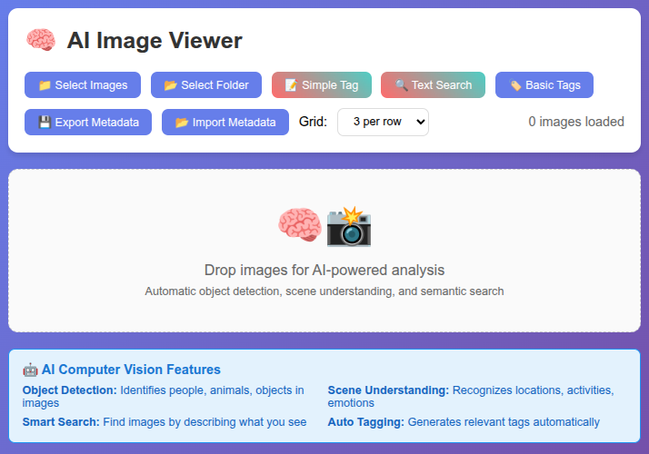

# AI Image Viewer

🧠 **A powerful, portable web-based image viewer with multiple AI model options for computer vision**

✨ **Ultra-Portable**: Single HTML file applications - no installation, no server, no dependencies. Just zip and share!



## 🎯 **Multiple AI Models Available**

Choose the best model for your needs - each optimized for different use cases:

| Version | Model | Accuracy | Best For | File |
|---------|-------|----------|----------|------|
| **Baseline** 🧠 | MobileNet v2 | 71% | Fast processing, mobile devices | `ai_image_viewer.html` |
| **Enhanced** 🎯 | EfficientNet | 77% | Higher accuracy, balanced performance | `ai_image_viewer_efficientnet.html` |
| **Advanced** 🚀 | MediaPipe | 82% | State-of-the-art, contextual understanding | `ai_image_viewer_mediapipe.html` |

## ✨ Features

### 🤖 AI Computer Vision
- **Object Detection** - Identifies people, animals, vehicles, furniture, and 80+ object classes (all models)
- **Scene Classification** - Recognizes outdoor/indoor scenes, activities, and environments
  - **MobileNet**: Basic scene recognition
  - **EfficientNet**: Enhanced scene understanding with higher accuracy
  - **MediaPipe**: Contextual scene analysis with real-world optimization
- **Auto-tagging** - Generates relevant tags based on visual content analysis
- **Smart Descriptions** - Creates natural language descriptions of image contents
- **Confidence Scoring** - Shows prediction reliability (accuracy varies by model)

### 🔍 Semantic Search
Search images by visual content with model-specific accuracy:
- `"person smiling"` - finds photos with happy people
- `"outdoor scene"` - finds landscape and nature photos  
- `"food and drinks"` - finds meal and dining photos
- `"vehicle"` - finds cars, trucks, motorcycles, etc.
- `"animals"` - finds pets and wildlife

**Search Quality by Model:**
- **MobileNet** 🧠: Basic keyword matching with AI tags
- **EfficientNet** 🎯: Enhanced relevance scoring with improved tags
- **MediaPipe** 🚀: Superior semantic understanding with contextual analysis

### 📁 File Management
- **Multi-format Support** - JPG, PNG, GIF, WebP, BMP
- **Bulk Operations** - Select individual files or entire folders
- **Drag & Drop** - Drop images directly onto the viewer
- **Metadata Export/Import** - Save and load AI analysis results
- **Editable Captions** - Click to edit image captions

### 🎨 User Interface
- **Responsive Grid Layout** - 1-6 images per row
- **Visual AI Indicators** - See which images have been analyzed
- **Real-time Progress** - Watch AI processing with live progress bars
- **Search Suggestions** - Common search queries for quick access
- **Mobile Optimized** - Works seamlessly on phones and tablets

## 🚀 Getting Started

### **Choose Your AI Model**

1. **🧠 Baseline (MobileNet)** - For fast processing and mobile devices
   ```bash
   open ai_image_viewer.html
   ```

2. **🎯 Enhanced (EfficientNet)** - For higher accuracy and better performance  
   ```bash
   open ai_image_viewer_efficientnet.html
   ```

3. **🚀 Advanced (MediaPipe)** - For state-of-the-art results and contextual understanding
   ```bash
   open ai_image_viewer_mediapipe.html
   ```

### **Basic Usage (All Versions)**

1. **Load Your Images**
   - Click "📁 Select Images" for individual files
   - Click "📂 Select Folder" to load an entire directory
   - Or drag and drop images directly onto the viewer

2. **Analyze with AI**
   - Click the AI Analyze button (🧠/🎯/🚀 depending on version)
   - Wait for analysis to complete (shows progress with model-specific messaging)
   - AI tags and descriptions will appear on each image

3. **Search Your Collection**
   - Click "🔍 AI Search" to open the search modal
   - Type natural language descriptions
   - Click search suggestions for quick queries
   - Results ranked by relevance (quality varies by model)

4. **Compare Results**
   - Load the same images in different versions
   - Compare accuracy and tag quality
   - Export metadata from each version for analysis

## 📦 **Portability & Collaboration**

### **Share Your Work Instantly**
The beauty of single-file HTML applications - just compress and share!

**Create Portable Package:**
```bash
# Using ZIP (cross-platform)
zip -r my-image-analysis.zip ai_image_viewer_efficientnet.html images/ *.json

# Using TAR (Mac/Linux preferred)
tar -czf my-image-analysis.tar.gz ai_image_viewer_efficientnet.html images/ *.json
```

**Uncompress and Use:**
```bash
# Unzip package
unzip my-image-analysis.zip
# OR extract tar
tar -xzf my-image-analysis.tar.gz

# Open HTML file - no installation needed!
open ai_image_viewer_efficientnet.html  # Mac
xdg-open ai_image_viewer_efficientnet.html  # Linux
# Or double-click the HTML file on Windows
```

### **Team Collaboration Workflows**

**1. Distribute Dataset for Analysis**
```bash
# Project lead creates initial package
tar -czf dataset-project.tar.gz ai_image_viewer.html images/
# Share with team members via email, cloud, or USB drive
```

**2. Crowd-Source Image Labeling**
- Each team member extracts the package locally
- Everyone analyzes their assigned image subset
- Export individual metadata JSON files
- Project lead merges all JSON results

**3. Collaborative Analysis Process**
```bash
# Team member workflow:
tar -xzf dataset-project.tar.gz        # Extract package
open ai_image_viewer.html               # Open analyzer
# Analyze assigned images (1-100, 101-200, etc.)
# Export metadata as "member1-analysis.json"
# Share JSON file back to project lead

# Project lead merges results:
# Import each member's JSON into master viewer
# Combine all analysis results
# Create final consolidated dataset
```

### **Use Cases for Portable Sharing**

**🤝 Collaborative Projects:**
- Research teams analyzing large image datasets
- Photographers organizing client photo shoots
- Content creators managing visual assets
- Students working on computer vision projects

**📱 Cross-Platform Sharing:**
- Works on Windows, Mac, Linux, iOS, Android
- No app store downloads or IT approval needed
- Perfect for BYOD (Bring Your Own Device) environments
- Runs in any modern web browser

**🌍 Remote Work Ready:**
- Share via email, Slack, Google Drive, Dropbox
- Works offline after initial model download
- No server setup or cloud dependencies
- Privacy-first: all processing happens locally

### **🤖 Automated Collaboration Tools**

For large datasets and team projects, choose your preferred automation tools:

#### **🐍 Python Tools** (`python3` / `pip`)

```bash
# Setup and split large datasets for team distribution
cd collab/python/
pip install click
python3 split_work.py -s /path/to/big-dataset -n 5

# Team members analyze their assigned packages
# Each gets all 3 HTML viewers + subset of images

# Merge completed work back together
python3 join_work.py ../split/work-package-*
```

#### **📦 JavaScript Tools** (`npx` / `npm`)

Modern Node.js tools for web development workflows:

```bash
# Setup and split large datasets for team distribution  
cd collab/js/
npm install
node split-work.js -s /path/to/big-dataset -n 5

# Team members analyze their assigned packages
# Each gets all 3 HTML viewers + subset of images

# Merge completed work back together
node join-work.js ../split/work-package-*
```

**📖 See [collab/README.md](collab/README.md) for complete dual-language collaboration workflow documentation.**

## 🔧 Technical Details

### AI Model Comparison

| Feature | MobileNet 🧠 | EfficientNet 🎯 | MediaPipe 🚀 |
|---------|-------------|----------------|---------------|
| **Framework** | TensorFlow.js | TensorFlow.js | MediaPipe + TensorFlow.js |
| **Model Size** | 14MB | 20MB | 25MB |
| **Load Time** | Fast (2-3s) | Medium (3-4s) | Slower (4-6s) |
| **Accuracy** | 71% | 77% (+6%) | 82% (+11%) |
| **Memory Usage** | Low | Medium | Higher |
| **Best For** | Mobile, speed | Balanced performance | Maximum accuracy |

### Common Components (All Versions)
- **TensorFlow.js 4.10.0** - Machine learning framework
- **COCO-SSD 2.2.2** - Real-time object detection (80 object classes)
- **WebGL Backend** - GPU acceleration when available

### Performance
- **Client-side Processing** - All AI runs locally in your browser
- **No Server Required** - Works completely offline after initial load
- **Automatic Caching** - Models and results cached for fast re-use
- **Progressive Loading** - UI remains responsive during analysis

### Browser Support
- **Modern Browsers** - Chrome 80+, Firefox 75+, Safari 13+, Edge 80+
- **Hardware Acceleration** - Uses WebGL for GPU acceleration when available
- **Fallback Mode** - Basic text search if AI models fail to load

## 📊 Supported Object Classes

The COCO-SSD model can detect 80 different object types:

**People & Animals**: person, bicycle, car, motorcycle, airplane, bus, train, truck, boat, bird, cat, dog, horse, sheep, cow, elephant, bear, zebra, giraffe

**Vehicles**: car, motorcycle, airplane, bus, train, truck, boat

**Furniture**: chair, couch, potted plant, bed, dining table, toilet

**Electronics**: tv, laptop, mouse, remote, keyboard, cell phone

**Kitchen**: microwave, oven, toaster, sink, refrigerator

**Sports**: tennis racket, bottle, wine glass, cup, fork, knife, spoon, bowl, banana, apple, sandwich, orange, broccoli, carrot, hot dog, pizza, donut, cake

**And many more...**

## 💾 Data Management

### Export Metadata
- Click "💾 Export Metadata" to save all AI analysis results
- Exports to `ai-image-metadata.json`
- Includes captions, tags, object detections, and timestamps
- Compatible across sessions and devices

### Import Metadata  
- Click "📂 Import Metadata" to load previous analysis results
- Automatically matches images by filename
- Restores captions, tags, and AI analysis data
- Useful for sharing analysis results

## 🎯 Use Cases

- **Photo Organization** - Auto-tag and categorize large photo collections
- **Content Discovery** - Find specific photos using natural language
- **Digital Asset Management** - Organize business or creative image libraries  
- **Research Projects** - Analyze and classify image datasets
- **Accessibility** - Generate descriptions for visually impaired users

## 🛠️ Development

### Project Structure
```
AI-Image-Viewer/
├── ai_image_viewer.html                    # 🧠 Baseline (MobileNet v2)
├── ai_image_viewer_efficientnet.html      # 🎯 Enhanced (EfficientNet)  
├── ai_image_viewer_mediapipe.html          # 🚀 Advanced (MediaPipe)
├── README.md                              # Main documentation
├── README-arch-design.md                  # Architecture & design details
├── ai-image-metadata.json                 # Sample/exported AI analysis data
├── readme.md                             # Basic project info  
├── docs/                                 # Documentation assets
│   └── ai_image_viewer.png              # Screenshot
└── images/                               # Sample images for testing
    ├── 2024-EQE350-4M-SEDAN-AVP-DR.webp
    ├── Giant_Panda_2004-03-2.jpg
    ├── Tiger-600x380.jpg
    └── ...                               # Additional test images
```

### Architecture
- **Single HTML File** - Entire application in one file for portability (each version)
- **Vanilla JavaScript** - No frameworks, pure JS for maximum compatibility
- **Progressive Enhancement** - Graceful degradation with enhanced fallback modes
- **Event-driven** - Responsive UI with async AI processing
- **Model Abstraction** - Easy to swap between different AI models

### Model Selection Guide
- **Choose MobileNet** 🧠 for:
  - Mobile devices or limited resources
  - Fast processing requirements
  - Basic image classification needs
  
- **Choose EfficientNet** 🎯 for:
  - Balanced accuracy and performance
  - Better scene understanding
  - Most general-purpose applications
  
- **Choose MediaPipe** 🚀 for:
  - Maximum accuracy requirements
  - Complex scene understanding
  - Research or professional applications

### Customization
- **Grid Layout** - Adjustable columns (1-6 per row, all versions)
- **AI Models** - Three ready-to-use model implementations
- **Styling** - Version-specific color schemes and UI indicators
- **Search Logic** - Model-specific relevance scoring algorithms

## 🔒 Privacy & Security

- **Local Processing** - All AI analysis happens in your browser
- **No Data Transmission** - Images never leave your device
- **No Tracking** - No analytics or external connections (except CDN for models)
- **Offline Capable** - Works without internet after initial model download

## 🤝 Contributing

This ultra-portable, self-contained application is perfect for:
- Adding new AI models (just swap the script tags!)
- Implementing additional search features  
- Improving the user interface
- Adding export formats
- Creating mobile apps
- Educational use in computer vision courses
- Research collaboration without infrastructure setup

## 📝 License

Open source project - feel free to use, modify, and distribute.

## 🙋 Support

For questions or issues:
1. Check the browser console for error messages
2. Ensure your browser supports WebGL for AI acceleration
3. Try the fallback text search if AI models fail to load
4. Clear browser cache and reload if models seem corrupted

---

**Built with ❤️ and powered by TensorFlow.js**